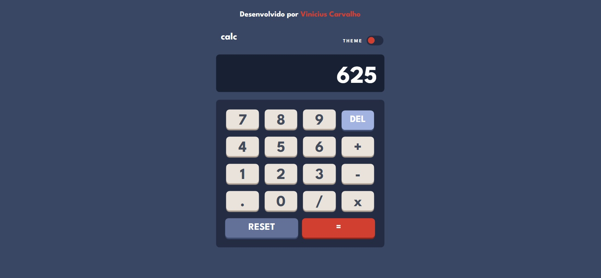
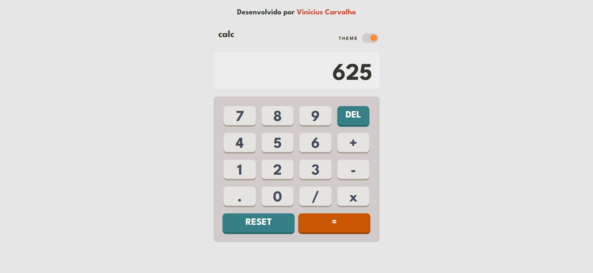
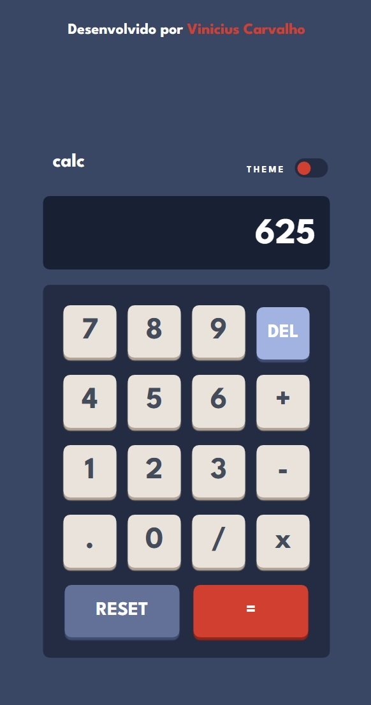

# **Calculator App Solution - Frontend Mentor**

## **Table of contents**

  - [The challenge](#the-challenge)
  - [Screenshot](#screenshot)
  - [Built with](#built-with)

### **The challenge**

Users should be able to:

- See the size of the elements adjust based on their device's screen size
- Perform mathmatical operations like addition, subtraction, multiplication, and division
- Adjust the color theme based on their preference

### **Screenshot**

-Desktop

-Mobile

### **Built with**

- Semantic HTML5 markup
- CSS
- JavaScript

